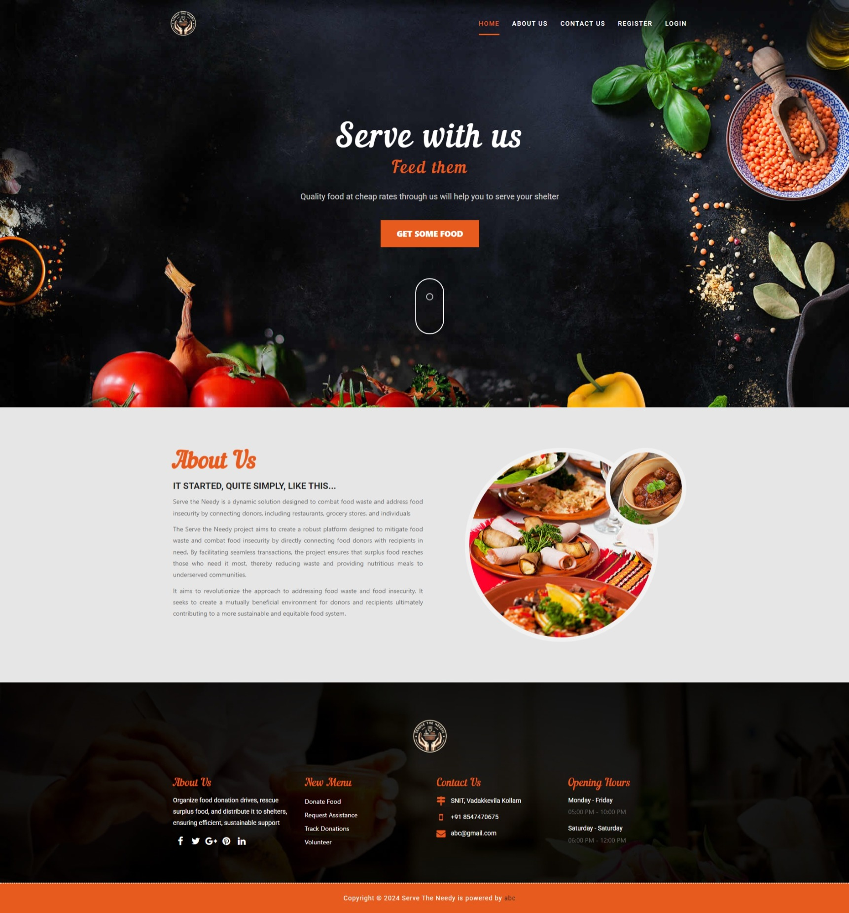
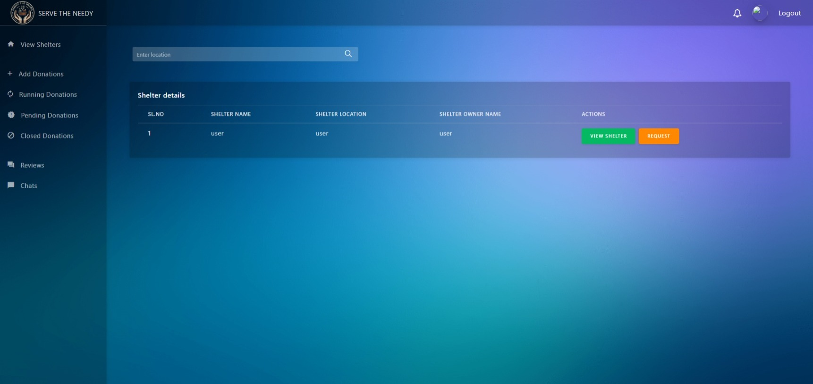
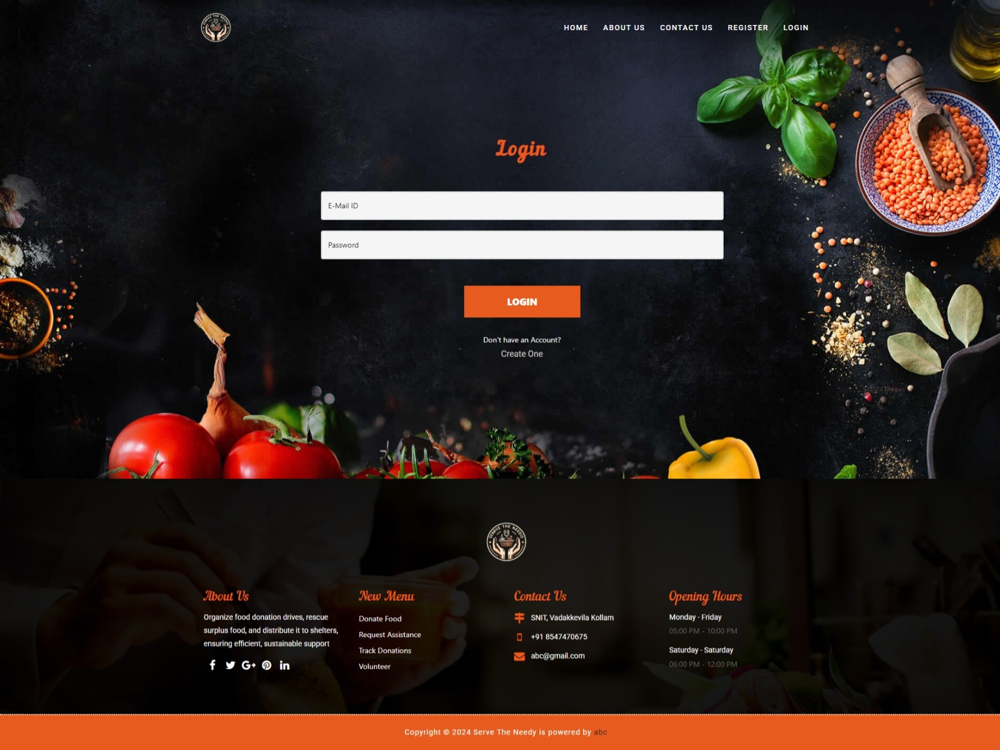

# Food Rescue and Redistribution 

The **Food Rescue and Redistribution** connects food donors (restaurants, stores, individuals) with recipients (shelters, food banks). It allows users to list surplus food, match with nearby recipients, and coordinate pickups. This app aims to reduce food waste and address food insecurity by facilitating the redistribution of food.

## Features

- **Food Donor-Recipient Matching**: Allows donors to list surplus food and match with nearby recipients.

- **Inventory Management**: Donors can manage their food donations and update availability.
- **Communication Tools**: In-app messaging for real-time coordination between donors and recipients.
- **Feedback System**: Allows users to rate and review food donations and recipients.
- **Notifications**: Users are alerted about new donations, pickups, and matches.
- **Reports & Analytics**: Generates insights on food rescue, community impact, and food waste reduction.

## Screenshots

## How It Works

1. **Donors List Surplus Food**: Donors create listings for available food items, including details such as quantity and expiration date.
2. **Matching Process**: The app matches donors with nearby recipients based on location and food type.
3. **Pick-up Coordination**: Donors and recipients coordinate food pickup through in-app messaging.
4. **Delivery & Feedback**: The food is delivered to recipients, and both parties provide feedback on the process.

## Technology Stack

- **Frontend**: React, CSS, HTML
- **Backend**: Node.js, Express.js
- **Database**: MongoDB

